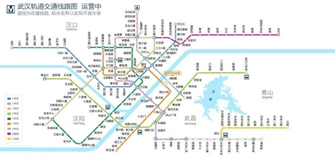

# 武汉地铁模拟系统

> 地铁，可以说是现代化大城市必不可少的交通工具。在大武汉的建设过程中，地铁建设正轰轰烈烈地进行中，已有的 9 条线路已经为上千万的武汉市民带来了极大的出行便利。在本次大作业中，请根据提供的已有线路的里程数据，创建一个武汉地铁的模拟运行系统，该系统由以下两大模块构成：

 

**线路查询**：在地铁模拟器中，我们可以为用户提供一些查询功能，比如告诉用户某一站点拥有的线路数，某条线路拥有的站点数，在用户输入起点和终点之后，自动为其提供两站之间的最优路线，以及对应的换乘次数、公里数和票价等。

 

**计价功能**：现行的计价规则主要是**按里程限时分段计价**。简单来说，票价取决于给定起点站和终点站之间的距离。当距离超过一定的范围则进入下一价格等级（具体数额参看地铁官网1）。除了正常买单程车票外，还提供了武汉通刷卡（9 折）和定期票（定期票在有效期内不限次数乘坐轨道交通，1 日票 18 元/张； 3 日票 45 元/张；7 日票 90 元/张）。

[1]. （10 分）请为以上描述的地铁系统建模，画出系统的用例图。任选其中一个用例，按照课本示例写出该用例的详细描述。

[2]. （10 分）画出该系统的类图（不需在图中显示所有方法）。

[3]. （80 分）用 Java 实现该系统，请注意合理地划分模块，渐进式地完成系统编码。

请构建包含 main 函数的测试类 Test，对系统不同功能进行测试（请使用与作业题目一同发给大家的测试数据，测试数据以 txt 文件格式给出，每一行内的分隔符为 Tab 符)。在文件 subway.txt 中存有每条线路两站之间的公里数，我们可以从该文件中读出整个地铁网的站点图。请至少完成以下功能：

1)  （10 分）给定站定名，返回经过该站点的所有线路的名称集合；

2)  （10 分）给定线路名和终点方向（比如 2 号线，光谷广场方向），返回该线路中所有站点的顺序列表；

3)  （20 分）给定起点站和终点站的名称，返回一条最短路径，该路径是一个包含从起点开始直到终点，所需要经过的所有站点的数组2。

4)  （10 分）当找到最短乘车路径后，我们需要把它以更方便的形式呈现给用户。请实现一个方法，将路径以简洁的形式打印至标准输出，仅包含每一段乘车路径的起始（比如先坐 1 号线从 A 站到 B 站，在 B 站换乘 2 号线到 C 站，等等）。

5)  （20 分）对于给定路径，计算其对应的乘车费用（普通单程票）；

6)  （10 分）对于同样的路径，计算使用武汉通和日票的乘客的票价（日票则返回 0 元）；

[4].  （选做，+10 分，总分不超过 100）为该地铁模拟系统提供一个图形界面。